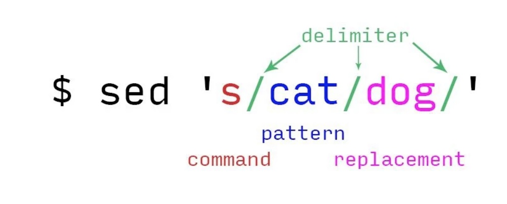

El comando SED es un editor de secuencias capaz de realizar
funciones en archivos como, buscar, reemplazar, insertar y
eliminar.
Puedes editar archivos sin tener que abrirlos, por tanto no es
necesario abrir un editor y modicar la cadena, la operación
se automatiza.

También se admiten expresiones regulares que permiten
comparar patrones complejos, aunque el uso más común del
comando es para buscar y reemplazar o sustituir cadenas.
En este articulo aprenderemos como usar el comando, y
aportaremos algunos ejemplos útiles.

# Uso del comando sed
La sintaxis del comando y su explicación.
```bash
sed [-ns] '[direccion] instruccion
argumentos'
```
Donde:
[direccion]: Es opcional, pero podemos especicar un
número de línea (N), rango de números de línea (N,M) o
búsqueda de regexp (/cadena/) indicando donde deben